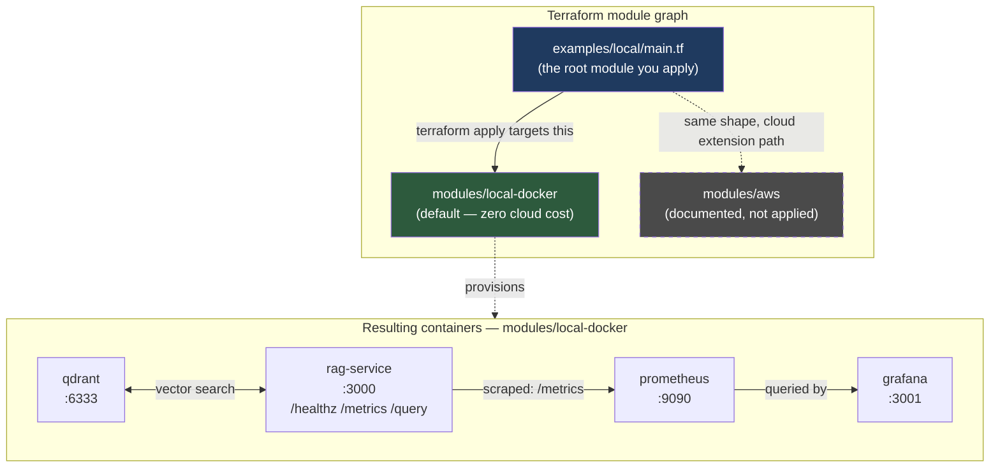

# ai-infra-terraform

Terraform modules that provision an AI/LLM stack — a RAG service, a vector database,
and an observability pipeline — reproducibly with `terraform apply`.

## The point of this repo

Most AI/ML portfolio projects are a script, a notebook, and a paragraph of "first,
manually install X, then run Y." That's fine for demonstrating a model or a pipeline,
but it doesn't demonstrate infrastructure discipline. This repo is the other half:
the same Infrastructure-as-Code habits that are table stakes for a DevOps
engineer — declarative resources, environments, state, variables instead of hardcoded
values, `plan` before `apply` — applied to AI infrastructure instead of a web app.

One `terraform apply` gives you a running RAG service, a vector database, and a
Prometheus/Grafana stack watching it — no manual `docker run` steps, no "SSH in and
install this."

This repo provisions the stack defined by two sibling repos:

- **[`rag-mlops-pipeline`](../rag-mlops-pipeline)** — the `rag-service` container
  (port 3000, `/healthz` `/metrics` `/query`) and its Dockerfile.
- **[`llm-observability-stack`](../llm-observability-stack)** — the Prometheus scrape
  config and Grafana provisioning/dashboards that watch it.

It's part of a small set of AI-infrastructure projects meant to be read together:
[`ai-agent-guardrails`](../ai-agent-guardrails) (policy enforcement for agent tool
calls), `rag-mlops-pipeline` (the service), `llm-observability-stack` (watching the
service), and this repo (provisioning all of it).

## Architecture



All four containers join a single shared Docker network (`docker_network.ai_infra`)
so they resolve each other by container name — the same name each expects per the
sibling repos' interface contract (`rag-service:3000`, `qdrant:6333`, etc.).

## Repo layout

```
ai-infra-terraform/
├── modules/
│   ├── local-docker/     # primary module — kreuzwerker/docker provider, $0 cost
│   │   ├── main.tf
│   │   ├── variables.tf
│   │   ├── outputs.tf
│   │   ├── versions.tf
│   │   └── templates/prometheus.yml.tpl
│   └── aws/              # extension module — documented, syntax-validated, NOT applied
│       ├── main.tf         (ECS Fargate rag-service + ALB + ECR)
│       ├── qdrant.tf        (EC2 + EBS, or Qdrant Cloud)
│       ├── observability.tf (AMP/AMG, or self-hosted ECS + EFS)
│       ├── storage.tf       (S3 corpus bucket)
│       ├── iam.tf
│       ├── variables.tf / outputs.tf / versions.tf
│       └── README.md        (why this module isn't applied)
├── examples/
│   └── local/             # <- run `terraform apply` HERE
│       ├── main.tf
│       ├── variables.tf
│       ├── outputs.tf
│       └── terraform.tfvars.example
├── LICENSE
└── .gitignore
```

## Quickstart (local, zero cloud cost)

**Prerequisites:** Docker Desktop (or another local Docker daemon) running, and
[Terraform](https://developer.hashicorp.com/terraform/install) ≥ 1.5.

1. Check out all three repos side by side:

   ```
   ~/GitHub/rag-mlops-pipeline
   ~/GitHub/llm-observability-stack
   ~/GitHub/ai-infra-terraform   <- you are here
   ```

2. Apply the local example:

   ```bash
   cd ai-infra-terraform/examples/local
   terraform init
   terraform apply
   ```

3. Hit the printed URLs:

   | Service      | URL                              |
   |--------------|-----------------------------------|
   | rag-service  | http://localhost:3000/healthz    |
   | Qdrant       | http://localhost:6333             |
   | Prometheus   | http://localhost:9090             |
   | Grafana      | http://localhost:3001 (admin/admin by default) |

4. Tear it down:

   ```bash
   terraform destroy
   ```

If your sibling repos live somewhere other than right next to this one, copy
`examples/local/terraform.tfvars.example` to `terraform.tfvars` and set
`rag_repo_path` / `observability_repo_path` to absolute paths instead — see
`examples/local/variables.tf`.

### Toggling build-from-source vs. pre-built image

By default `rag_service_build_from_source = true`, so Terraform builds the
`rag-service` image from `rag_repo_path`'s Dockerfile on every apply where its
inputs changed (see the `triggers` block on `docker_image.rag_service` in
`modules/local-docker/main.tf`). Set `rag_service_build_from_source = false` and
`rag_service_image = "your/registry/rag-service:tag"` to pull a pre-built image
instead.

## Why the AWS module isn't applied

`modules/aws` shows the same stack's shape on AWS — ECS Fargate for `rag-service`
behind an ALB, EC2+EBS for Qdrant (or Qdrant Cloud), Amazon Managed
Prometheus/Grafana for observability (or a self-hosted ECS alternative), S3 for the
document corpus. `terraform init` and `terraform validate` both pass against it (see
below) — it is complete, syntactically valid HCL, not pseudo-code.

It has never been `plan`'d or `apply`'d against a real AWS account. An ALB, an EC2
instance, and an EFS filesystem all accrue an hourly charge from the moment they
exist, regardless of traffic — keeping a demo "live" 24/7 for portfolio purposes
would mean paying AWS to prove a point that `terraform validate` already proves for
free. Declining to spend money keeping infrastructure running that nobody is using
is itself the judgment call worth showing, not a gap in the work. `modules/aws/README.md`
has the full reasoning plus what changes if you do want to apply it.

## Did `terraform validate` actually run?

Yes, on both modules, in this environment. Terraform wasn't preinstalled, so it was
installed via `brew install hashicorp/tap/terraform` (Terraform 1.15.8) and used
directly — full `init`/`validate` output, unedited:

```
$ cd examples/local && terraform init && terraform validate
Initializing the backend...
Initializing modules...
- ai_infra in ../../modules/local-docker
Initializing provider plugins...
- Finding kreuzwerker/docker versions matching "~> 3.0"...
- Finding hashicorp/local versions matching "~> 2.5"...
- Installing kreuzwerker/docker v3.9.0...
- Installing hashicorp/local v2.9.0...
Terraform has been successfully initialized!

Success! The configuration is valid.

$ cd modules/aws && terraform init && terraform validate
Initializing provider plugins...
- Finding hashicorp/aws versions matching "~> 5.0"...
- Installing hashicorp/aws v5.100.0...
Terraform has been successfully initialized!

Success! The configuration is valid.
```

`validate` on `modules/aws` caught a real bug during this build: an em dash in an
`aws_security_group` ingress `description` failed AWS's character-set restriction
(`^[0-9A-Za-z_ .:/()#,@\[\]+=&;{}!$*-]*$`). Fixed in `modules/aws/observability.tf`.
That's the kind of thing `validate` is for — it isn't just a formality.

Only `validate` was run against `modules/aws` (no `plan`/`apply` — see above).

`modules/local-docker` has since been `apply`'d for real, end to end, against the
actual sibling repos — this is the update after doing that:

```
$ cd examples/local && terraform apply -auto-approve
...
Apply complete! Resources: 11 added, 0 changed, 0 destroyed.
```

`apply` caught a real bug `validate` could never catch, because `validate` never
talks to a Docker daemon: the provider's default socket
(`unix:///var/run/docker.sock`) doesn't exist on macOS Docker Desktop, which listens
on `~/.docker/run/docker.sock` instead. First `apply` failed on the very first
resource with "Cannot connect to the Docker daemon." Fixed by adding a `docker_host`
variable (see `terraform.tfvars.example`) instead of hardcoding a path — Linux and
other Docker Desktop configs may already resolve correctly via the provider default.

With that fixed, the full stack came up and was exercised for real, not just
inspected:
- `POST /query` against the live containerized `rag-service` returned a real
  Ollama-generated answer, correctly grounded in the top-retrieved chunk from a live
  Qdrant collection populated by `ingest.py`.
- `GET http://localhost:9090/api/v1/targets` showed the `rag-service` scrape target
  `up` (previously `down` with nothing to scrape).
- The real request showed up as `rag_requests_total{status="ok"} 1` in Prometheus,
  queryable through Grafana's own datasource proxy — confirming the dashboard would
  render live traffic, not just that its JSON parses.

Known rough edges found during that run, left as-is rather than hidden: the pinned
`qdrant-client` version in `rag-mlops-pipeline` is newer than the `qdrant/qdrant:v1.11.0`
image this module pins, which prints a compatibility warning (harmless in this case,
worth aligning if the gap ever widens); a single CPU-only `llama3.2` generation took
~31s, which is expected for an unaccelerated 3B model and not something this module
tries to hide behind a faster default.

## Assumptions

- The sibling repos (`rag-mlops-pipeline`, `llm-observability-stack`) are checked out
  next to this one, per the interface contract each already documents
  (`rag-service` on port 3000 with `/healthz` `/metrics` `/query`; Grafana
  provisioning under `grafana/provisioning/` and `grafana/dashboards/`).
- `llm-observability-stack`'s `prometheus/` and `grafana/provisioning/`
  `grafana/dashboards/` directories may not be populated yet in a fresh checkout — the
  local module ships its own generated `prometheus.yml` (via
  `templates/prometheus.yml.tpl`) so `terraform apply` doesn't hard-depend on that
  sibling repo's scrape config existing, only on its Grafana provisioning tree for
  the Grafana bind mount.
- `qdrant`, `prometheus`, and `grafana` image tags are pinned (not `latest`) for
  reproducible applies, matching the versions already pinned in
  `llm-observability-stack`'s `docker-compose.yml` where applicable.
